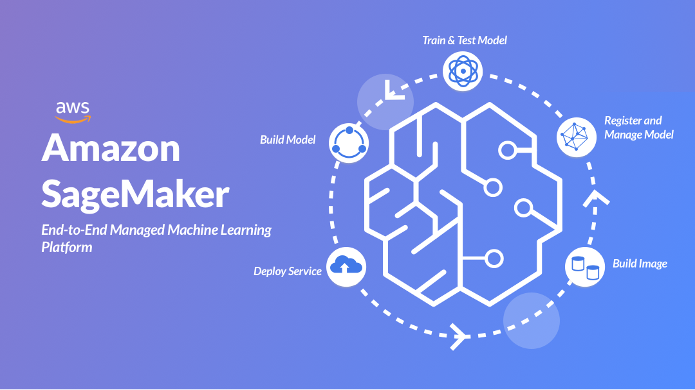

## Welcome to Sagemaker Immersion Day Labs

Amazon SageMaker Immersion Day helps customers and partners to provide end to end understanding of building ML use cases from feature engineering to understanding various built-in algorithms, train, tune and deploy steps of ML model in production-like scenarios. It demonstrates advanced concepts such as model monitoring, hyperparameters tuning and AutoML, guides to evaluate machine leaning workload through Machine Learning Lens of AWS Well-Architected Framework.

## License

This library is licensed under the MIT-0 License. See the LICENSE file.

